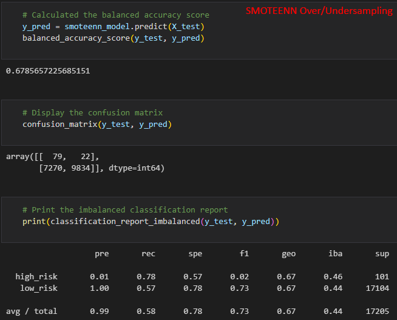

# Credit Risk Analysis with Supervised Machine Learning

## Overview of Credit Risk Analysis
In this challenge assignment, we use a sample credit card dataset from LendingClub to try to predict credit risk using machine learning. We use the `imbalanced-learn` and `scikit-learn` libraries to build and evaluate models using resampling. The dataset contains a variety loan information for customers as well as their loan's standing. Using this data, we will train several different machine learning algorithms and compare their outcomes and ability to correctly predict credit risk. The deliverables are as follows:

- **Deliverable 1: Use Resampling Models to Predict Credit Risk**: Using the `imbalanced-learn` and `scikit-learn` libraries, evaluate three machine learning models by using resampling to determine which is better at predicting credit risk. First, use the oversampling `RandomOverSampler` and `SMOTE` algorithms, and then use the undersampling `ClusterCentroids` algorithm. Using these algorithms, resample the dataset, view the count of the target classes, train a logistic regression classifier, calculate the balanced accuracy score, generate a confusion matrix, and generate a classification report.
- **Deliverable 2: Use the SMOTEENN Algorithm to Predict Credit Risk**: Using the `imbalanced-learn` and `scikit-learn` libraries, perform a combinatorial approach of over- and undersampling with the `SMOTEENN` algorithm to determine if the results from the combinatorial approach are better at predicting credit risk than the resampling algorithms from Deliverable 1. Using the `SMOTEENN` algorithm, resample the dataset, view the count of the target classes, train a logistic regression classifier, calculate the balanced accuracy score, generate a confusion matrix, and generate a classification report.
- **Deliverable 3: Use Ensemble Classifiers to Predict Credit Risk**: Using the `imblearn.ensemble` library, train and compare two different ensemble classifiers, `BalancedRandomForestClassifier` and `EasyEnsembleClassifier`, to predict credit risk and evaluate each model. Using both algorithms, resample the dataset, view the count of the target classes, train the ensemble classifier, calculate the balanced accuracy score, generate a confusion matrix, and generate a classification report.

## Resources
- Data Source: [LendingClub Dataset](data/LoanStats_2019Q1.csv)
- Language(s): Python
- Application(s): Jupyter Notebook
- Final Resampling Script: [credit_risk_resampling.ipynb](credit_risk_resampling.ipynb)
- Final Ensemble Script: [credit_risk_ensemble.ipynb](credit_risk_ensemble.ipynb)

## Naive Random Oversampling (NRO) Results
Script and output for the Naive Random Oversampling model can be found below: 

- Balanced Accuracy Score: 66.0%
- Precision Score: 1% for high-risk, 100% for low-risk
- Recall Score: 69% for high-risk, 63% for low-risk

## SMOTE Oversampling Results
Script and output for the SMOTE Oversampling model can be found below: 

- Balanced Accuracy Score: 65.8%
- Precision Score: 1% for high-risk, 100% for low-risk
- Recall Score: 62% for high-risk, 69% for low-risk

## Cluster Centroids Undersampling (CCU) Results
Script and output for the Cluster Centroids Undersampling model can be found below: 

- Balanced Accuracy Score: 54.5%
- Precision Score: 1% for high-risk, 100% for low-risk
- Recall Score: 69% for high-risk, 40% for low-risk

## SMOTEENN Combined Over- and Undersampling Results
Script and output for the SMOTEENN Combined Over- and Undersampling model can be found below: 

- Balanced Accuracy Score: 67.9%
- Precision Score: 1% for high-risk, 100% for low-risk
- Recall Score: 78% for high-risk, 57% for low-risk

## Balanced Random Forest (BRF) Ensemble Classifier Results
Script and output for the Balanced Random Forest Ensemble Classifier model can be found below: 

- Balanced Accuracy Score: 78.9%
- Precision Score: 3% for high-risk, 100% for low-risk
- Recall Score: 70% for high-risk, 87% for low-risk

The features that trained the model are sorted by their importance here (highest to lowest, in three columns):

## Easy Ensemble (EE) AdaBoost Classifier Results
Script and output for the Naive Random Sampling model can be found below: 

- Balanced Accuracy Score: 93.2%
- Precision Score: 9% for high-risk, 100% for low-risk
- Recall Score: 92% for high-risk, 94% for low-risk

## Summary
A summary table of all six models is shown here for easier comparison:

The precision for the low-risk customers is 100% for all models, meaning that all of the models correctly flagged low-risk customers as such, and none (or nearly none) was incorrectly flagged as high-risk. However, the precision for high-risk customers is very low for all models, meaning that the models incorrectly flagged a large number of customers as high-risk who actually were not. The precision for high-risk customers was the highest for the Easy Ensemble (EE) model at 9%. This number is still low, but that is alright in this case since the bank would probably prefer to over-predict high-risk loans for rejection rather than under-predict them and lose money when customers default, miss payments, etc.

The recall was not very high for most of the models except the EE model. The EE model correctly identified 92% of high-risk customers and 94% of low-risk customers. Additionally, the overall accuracy was highest for the EE model as well at 93.2%. Because of the high accuracy and recall, the EE model is the best option among the six tested. However, the bank needs to take into account the low precision for high-risk customers before making a final decision.

The bank needs to perform some calculations to determine if the business lost from the model having a low precision for high-risk customers (i.e. incorrectly flagging certain customers as high-risk and turning their business away even though they are low-risk) would be outweighed by the cost-savings of accurately predicting and rejecting the vast majority of high-risk customers. If the low precision for high-risk customers is tolerable, then the EE model is suitable for their purposes.